# 工业视觉 AI 分析系统 | 多模态协同检测与高并发监控平台（课程设计）

> 基于 Qwen-VL、SAM-3、YOLOv8 的工业缺陷检测系统，实现五范式架构与多生产线并发监控。面向轴承/木材/芯片工业生产线的视觉检测场景。

[](https://www.python.org/)
[](https://pytorch.org/)
[](https://streamlit.io/)

---

## 一、项目概述

### 1.1 解决了什么问题

工业视觉检测长期面临三个核心矛盾：

1. **泛化 vs 精度**：单一模型无法覆盖多行业、多材质、多缺陷类型
2. **云端 vs 边缘**：大模型精度高但依赖 API、延迟高；小模型速度快但泛化差
3. **精度 vs 成本**：高质量标注数据获取成本极高，冷启动产线无历史样本

本项目设计**五范式架构**覆盖从零样本探索到批量生产的全生命周期，并实现**三层检测体系**协调大模型与小模型各自优势。

### 1.2 核心技术指标

| 指标 | 数值 | 说明 |
|------|------|------|
| VLM bbox 解析管道 | 600+ 行 | `core/vlm_bbox.py`，含五级验证 |
| VLM 支持模型数 | 8 种 | `core/vlm_model_registry.py` |
| 准召验证 (冷启动) | **单图 ~1.5s** | 范式 C (VLM+SAM) 自动化标注管线小批量跑通验证 |
| 并发量产模拟 (轴承) | **72.5%** | mAP50, 导入 2561 张公开数据集验证 SharedModelManager 并发 |
| 并发量产模拟 (木材) | **87.8%** | mAP50, 导入 4000 张公开数据集验证边缘端 C++ 高频请求 |
| 多线并发规模 | **1-6 条** | `SharedModelManager` 单例模式 |
| GPU 监控指标 | 4 项 | NVML：显存/利用率/温度/功耗 |
| C++ SDK 帧协议 | 2 种 | TCP 防粘包 + MJPEG 双通道 |
| 缺陷行业模板 | 5 类 | 金属/PCB/纺织/食品/通用（YAML 热插拔）|

---

## 二、测试结果

### 2.1 测试环境

| 项目 | 配置 |
|------|------|
| CPU | 13th Gen Intel Core i5-13500HX (2.50 GHz) |
| GPU | NVIDIA GeForce RTX 4060 Laptop，8 GB 显存 |
| 内存 | 16 GB |
| 操作系统 | Windows 11 |
| Python | 3.13.0，CUDA 12.9 |
| PyTorch | 2.7.1+cu126 |

### 2.2 范式 A — 在线语义探索

**单关键词检测（SAM-3 文本提示）：**

| 测试项 | 输入 | 结果 |
|--------|------|------|
| 螺丝检测 | prompt="screw" | 成功检测 |
| 晶体管检测 | prompt="transistor" | 成功检测 |

**多关键词策略对比：**

| 策略 | 输入 | 检出实例数 | 推理时间 |
|------|------|-----------|---------|
| join_string（拼接推理） | "transistor, screw" | 2 | 1245.2 ms |
| VLM 推荐词（qwen-vl-max） | industrial_defect 模式 | 4 词 | 646.6 ms |

**批量推理（8 张）：**

| 类别 | 关键词 | 检出率 | 平均推理时间 | 置信度 |
|------|--------|--------|------------|--------|
| Wood | Hole Defect | 87.5% | 0.6 s | 0.52 |
| Pill | Stains | 92.1% | 0.6 s | 0.85 |

**界面截图：**

- 范式选择界面
  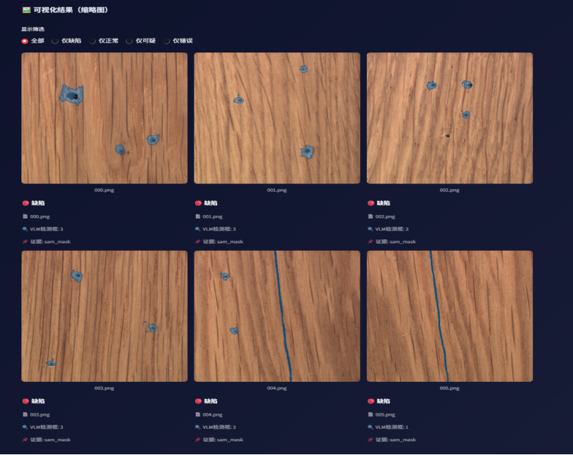

- 多关键词推理（"transistor, screw"）
  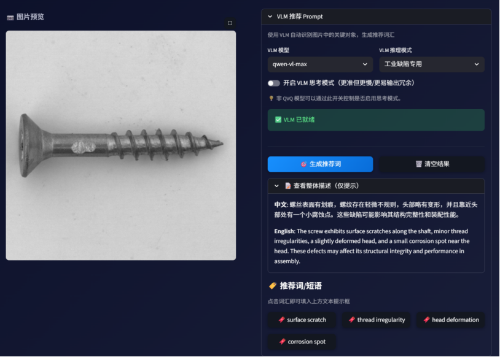

- VLM 推荐词生成
  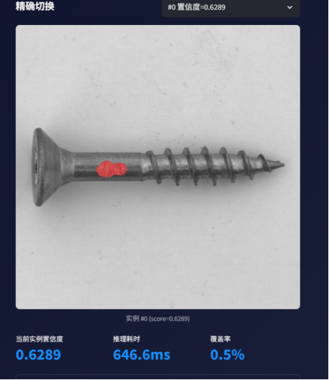

- 批量检测结果（8 张，展示 6 张）
  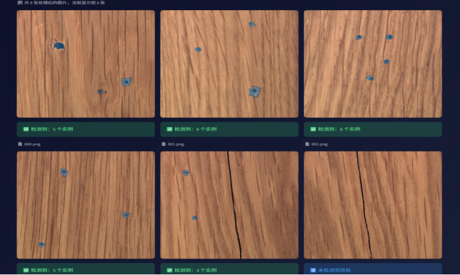

### 2.3 范式 B — 离线异常检测

**PaDiM 训练（metal_nut，MVTec AD 数据集，8 张正常样本）：**

| 指标 | 数值 |
|------|------|
| 分数分布范围 | 10.31 ~ 19.436 |
| 自动阈值（P99） | 19.421 |
| 均值 | 14.502 |
| 测试图异常分数 | **25.64**（超出阈值，判定为异常）|

> 热力图精准定位至金属螺母右上角异常区域。

**界面截图：**

- 训练分数分布直方图
  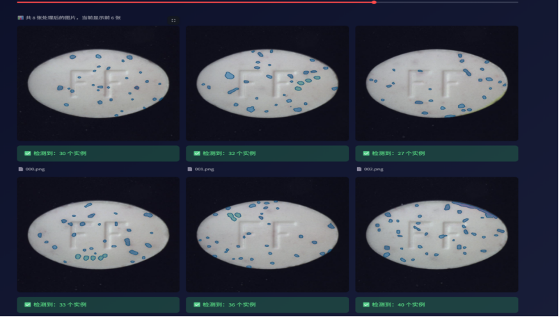
  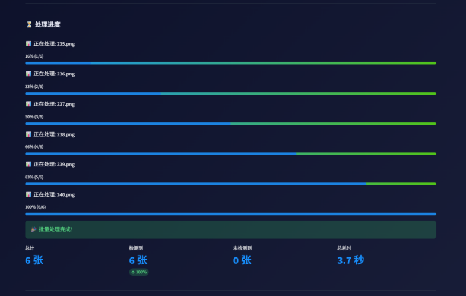

- 异常热力图（红色高亮区域即为缺陷）
  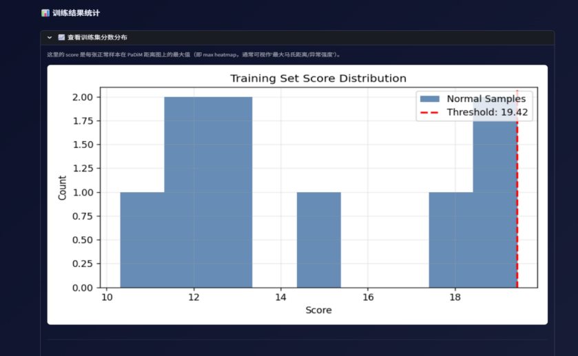

### 2.4 范式 C — VLM 定位 + SAM 精准分割

**单图检测（qwen-vl-max）：**

| 输入模式 | 缺陷类型 | 置信度 | IoU（掩码 vs VLM框）|
|----------|---------|--------|---------------------|
| 单图 | Surface stain | 0.95 | 0.576 |
| 对比模式 | scratch | 0.95 | — |

> 检测结果经五级 bbox 净化管道，输出标准化 JSON：类型、坐标 xyxy、置信度。

**界面截图：**

- 原始图 → SAM-3 精分割
  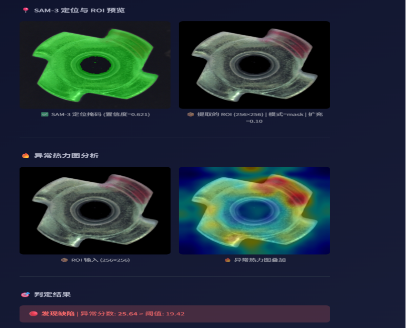
  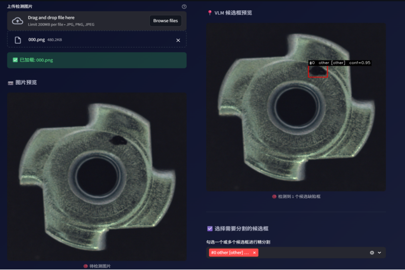

- 对比模式：正常图 vs 检测结果
  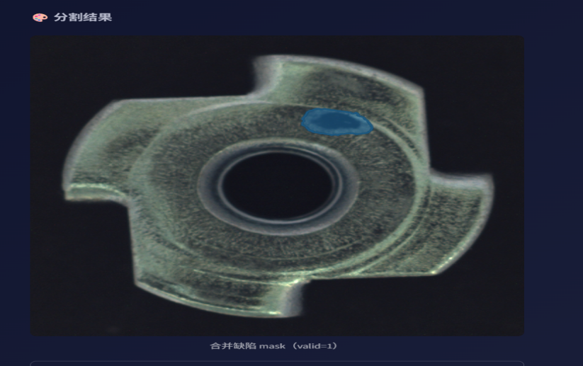
  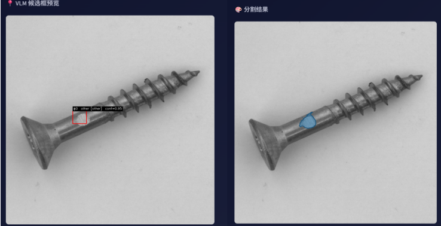

- 批量处理（6 张，Wood 类别，检出 3~4 个缺陷）
  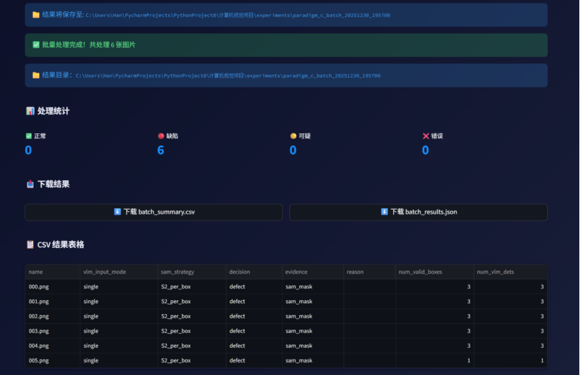

### 2.5 测试小结

| 范式 | 核心能力 | 实测性能 |
|------|---------|---------|
| A | 零样本分割，VLM 推荐关键词 | 批量检出率 87~92%，推理 ~0.6s/张 |
| B | 无需标注数据，PaDiM 统计建模 | 8 张正常样本即可建立检测模型 |
| C | VLM bbox → SAM 精分割 → YOLO 导出 | 单图 ~1.5s，IoU 0.576，置信度 0.95 |

---

## 三、系统架构

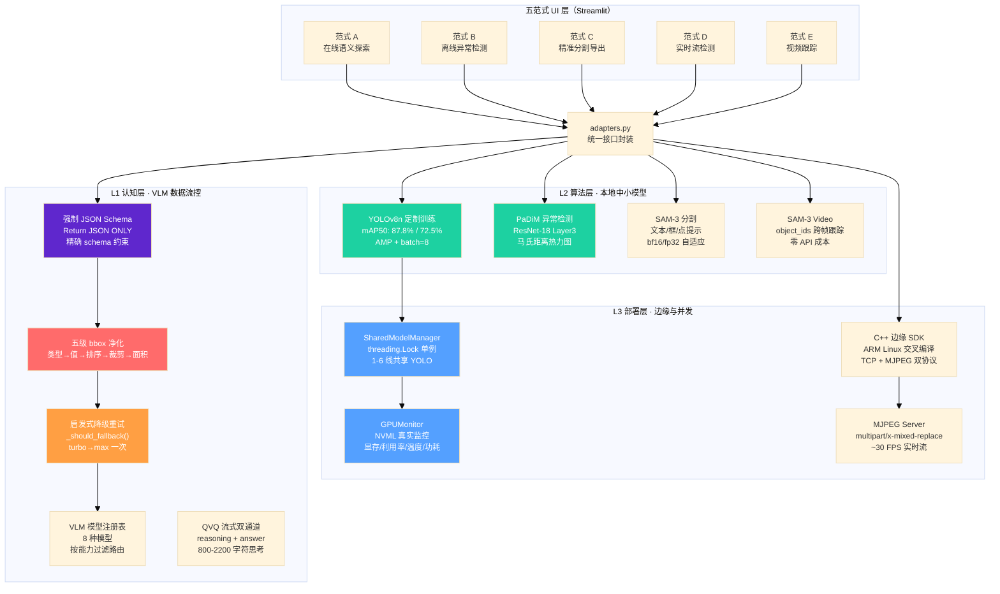

### 2.1 数据流图

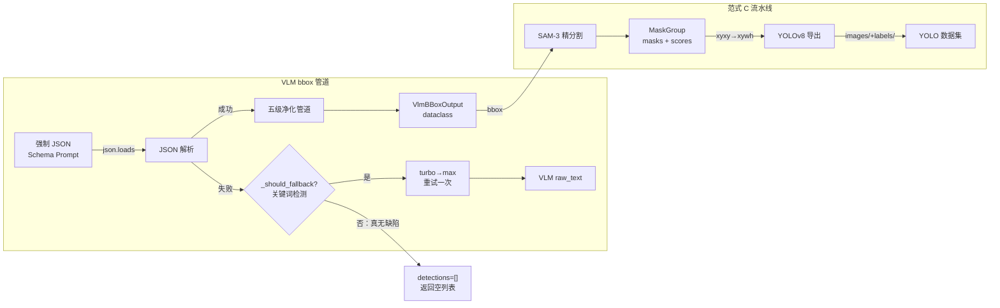

### 2.2 多线并发架构

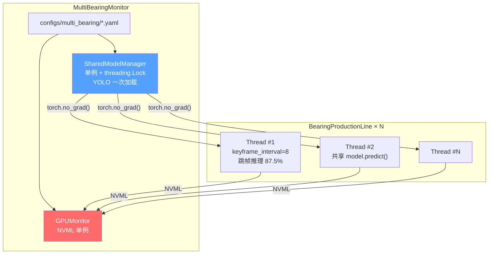

---

## 四、核心模块详解

### 3.1 VLM bbox 结构化解析管道

**文件**: [`core/vlm_bbox.py`](计算机视觉项目/core/vlm_bbox.py)（600+ 行）

VLM 输出的不可控性是工业落地的主要痛点。本模块从零构建了完整的解析与验证管道：

```python
# 五级 bbox 净化管道（vlm_bbox.py:86-115）
def _sanitize_bbox_xyxy(b: Any, *, w: int, h: int) -> Optional[list[int]]:
    # L1: 类型验证 — 必须是长度为 4 的 list/tuple
    if not isinstance(b, (list, tuple)) or len(b) != 4:
        return None
    # L2: 值转换验证 — 三重强制转换 int(round(float(x)))
    try:
        x1, y1, x2, y2 = [int(round(float(x))) for x in b]
    except Exception:
        return None
    # L3: 坐标排序 — 自动修正 x1>x2 或 y1>y2 的错误
    x1, x2 = sorted([x1, x2])
    y1, y2 = sorted([y1, y2])
    # L4: 边界裁剪 — clamp 到 [0, w)×[0, h)
    x1 = _clamp(x1, 0, max(0, w - 1))
    y1 = _clamp(y1, 0, max(0, h - 1))
    x2 = _clamp(x2, 0, w)
    y2 = _clamp(y2, 0, h)
    # L5: 面积保障 — 宽高至少 1 像素
    if x2 <= x1: x2 = min(w, x1 + 1)
    if y2 <= y1: y2 = min(h, y1 + 1)
    return [int(x1), int(y1), int(x2), int(y2)]
```

**强制 JSON Schema Prompt**（vlm_bbox.py:230-282）：

```
Return JSON ONLY. Do NOT output markdown. Do NOT output any extra text outside JSON.
Use this JSON schema exactly:
{"image_width": <int>, "image_height": <int>,
 "detections": [{"defect_type": <string>, "anomaly_subtype": <string>,
  "bbox_xyxy": [<int>,<int>,<int>,<int>], "confidence": <float>}]}
```

**启发式降级决策**（vlm_bbox.py:340-366）：

```python
def _should_fallback(out: VlmBBoxOutput) -> bool:
    if out.detections: return False          # 有结果，无需回退
    raw = (out.raw_text or "").strip().lower()
    if not raw: return False                 # 空文本+空检测 = 真无缺陷
    # 关键词检测：区分"解析失败"与"真无缺陷"
    suspicious = ["error", "exception", "traceback", "http", "failed", "invalid", "timeout"]
    if any(s in raw for s in suspicious): return True
    if "{" not in raw: return True           # 无 JSON 结构 = 解析失败
    return False
```

**QVQ 流式双通道分离**（[`core/dashscope_stream.py`](计算机视觉项目/core/dashscope_stream.py):60-113）：

```python
# QVQ 模型原生输出两个字段：reasoning_content（思考过程）+ content（最终回答）
reasoning_content = ""   # 通道1：推理过程，约 800-2200 字符
answer_content = ""      # 通道2：最终 JSON 答案

for chunk in response:
    reasoning_chunk = message.get("reasoning_content", None)
    if reasoning_chunk:
        reasoning_content += reasoning_chunk  # 聚合思考过程
    if message.content:
        for item in message.content:
            if isinstance(item, dict) and "text" in item:
                answer_content += item["text"]  # 聚合最终答案
```

---

### 3.2 PaDiM 异常检测

**文件**: [`core/padim.py`](计算机视觉项目/core/padim.py)（统计量）+ [`core/feature_extractor.py`](计算机视觉项目/core/feature_extractor.py)（特征提取）

PaDiM 解决产线冷启动问题：无需缺陷样本，仅需正常样本构建统计模型。

```
正常样本 N 张
    │
    ▼
ResNet-18 Layer3 提取特征 [B, 256, 16, 16]
    │
    ▼
PaDiM 统计量构建
    ├── means[p]   = E[Xᵢ]           第 p 个位置的均值向量
    └── inv_covs[p] = 1 / (Var[Xᵢ] + ε)  对角协方差逆
    │
    ▼
保存 .npz 模型文件
    │
    ▼ 新样本推理
马氏距离图 D = √(Σ (xᵢ-μᵢ)² × 1/σᵢ²)
    │
    ▼
异常热力图（高距离 = 异常）
```

对角协方差近似将 256×256 矩阵简化为 256 维向量，计算量降低约 **500 倍**。

---

### 3.3 SAM-3 实例分割

**文件**: [`core/sam3_infer.py`](计算机视觉项目/core/sam3_infer.py)

支持三种提示模式，文本提示提供两种合并策略：

```python
# per_prompt（推荐）：逐词推理并合并，稳定性最高
# join_string：多词拼接成一句，一次推理，速度更快

def merge_instance_results(result_list):
    """合并多个 SAM-3 分割结果"""
    masks_all = [r["masks"] for r in result_list if r.get("masks") is not None]
    scores_all = [r["scores"].float() for r in result_list if r.get("scores") is not None]
    return {
        "masks": torch.cat(masks_all, dim=0) if masks_all else torch.empty((0, 1, 1)),
        "scores": torch.cat(scores_all, dim=0) if scores_all else torch.empty((0,))
    }
```

动态 dtype 策略：检测 GPU 是否支持 bf16（Ampere+ 架构，如 RTX 3060/4060），不支持则降级 float32。

---

### 3.4 多轴承并发监控系统

**文件**: [`bearing_core/multi_bearing_monitor.py`](bearing_core/multi_bearing_monitor.py)（687 行）

两个核心单例类：

```python
class SharedModelManager:
    """共享 YOLO 单例 — 避免显存爆炸"""
    _instance = None
    _lock = threading.Lock()

    def __new__(cls, model_path, device='cuda:0'):
        if cls._instance is None:
            with cls._lock:  # 双重检查锁定
                if cls._instance is None:
                    cls._instance = super().__new__(cls)
                    cls._instance._init_model(model_path, device)
        return cls._instance

    def _init_model(self, model_path, device):
        self.model = YOLO(model_path).to(device)
        if hasattr(self.model.model, 'share_memory'):
            self.model.model.share_memory()  # PyTorch 共享内存
```

```python
class GPUMonitor:
    """NVML 真实 GPU 监控 — 不只是 PyTorch 估算"""
    _instance = None

    def get_gpu_stats(self):
        mem_info = pynvml.nvmlDeviceGetMemoryInfo(self._handle)
        util = pynvml.nvmlDeviceGetUtilizationRates(self._handle)
        temp = pynvml.nvmlDeviceGetTemperature(self._handle, NVML_TEMPERATURE_GPU)
        power = pynvml.nvmlDeviceGetPowerUsage(self._handle) / 1000  # mW → W
        # PyTorch 降级：仅能获取显存，无法获取利用率/温度/功耗
```

关键帧跳帧策略：`keyframe_interval=8` 意味着每 8 帧检测一次，其余 7 帧复用最近检测结果，**推理频率降低 87.5%**，同时保持视觉效果连续性（`detection_display_frames=45` 帧内持续显示检测框）。

---

### 3.5 C++ 边缘 SDK

**文件**: [`edge_device/src/`](计算机视觉项目/edge_device/src/)

TCP 帧协议防粘包设计（[`core/socket_server.py`](计算机视觉项目/core/socket_server.py):12-16）：

```
帧结构（8 字节头 + 可变长数据）：
┌──────────┬──────────┬─────────────────────┐
│ magic    │ jpeg_len │ jpeg_data           │
│ 0xABCD1234│ 4 字节   │ 最大 512KB          │
└──────────┴──────────┴─────────────────────┘
```

服务端重同步机制：当 magic 不匹配时，在缓冲区中向后搜索下一个 magic 字节序列，避免单帧损坏导致整个连接失效。

---

### 3.6 VLM 模型注册表

**文件**: [`core/vlm_model_registry.py`](计算机视觉项目/core/vlm_model_registry.py)（162 行）

```python
@dataclass(frozen=True)
class VlmModelSpec:
    name: str
    supports_bbox_json: bool = True
    json_reliability: str = "medium"   # high / medium / low / unknown
    cost_tier: str = "medium"         # high / medium / low
    requires_stream: bool = False      # QVQ 系列标志

_REGISTRY = (
    VlmModelSpec("qwen-vl-max",       json_reliability="high",  cost_tier="high"),
    VlmModelSpec("qvq-max",           requires_stream=True,      json_reliability="high"),
    VlmModelSpec("qvq-plus",          requires_stream=True,      json_reliability="high"),
    VlmModelSpec("qwen3-vl-plus",     json_reliability="high",  cost_tier="high"),
    VlmModelSpec("qwen3-vl-flash",    json_reliability="medium", cost_tier="low"),
    # ... 共 8 种模型，按能力静态过滤
)
```

---

## 五、五大范式

| 范式 | 名称 | 核心技术链路 | 典型场景 |
|------|------|------------|---------|
| **A** | 在线语义探索 | VLM 关键词 → SAM-3 零样本分割 | 输入"划痕"即可分割，零样本冷启动 |
| **B** | 离线异常检测 | 正常样本 → PaDiM 统计量 → 马氏距离热力图 | 产线冷启动，无需任何标注数据 |
| **C** | 精准分割导出 | VLM bbox → SAM-3 精修 → xyxy→xywh → YOLO 格式 | 构建自己的训练数据集 |
| **D** | 实时流检测 | 边缘设备 → Socket/MJPEG → YOLO 推理 → 实时看板 | 生产线 24h 连续监控 |
| **E** | 视频跟踪检测 | SAM-3 Video object_ids → 跨帧实例跟踪 | 批量视频缺陷统计，无需逐帧调用 API |

---

## 六、快速开始

### 5.1 环境准备

```bash
# Python >= 3.10，CUDA >= 11.8
pip install -r requirements.txt
```

SAM-3 模型首次运行自动从 ModelScope 下载（`facebook/sam3`）。

### 5.2 启动五范式系统

```bash
cd 计算机视觉项目
streamlit run app_final.py
# 浏览器打开 http://localhost:8501
```

### 5.3 启动多轴承监控

```bash
python start_multi_bearing_monitor.py
# 按提示选择生产线数量（1-6）
```

### 5.4 训练自定义 YOLO 模型

```bash
python train_production_lines.py
# 菜单：1=全部 / 2=轴承 / 3=木材 / 4=芯片
```

---

## 七、文件结构

```
.
├── app_final.py                          # Streamlit 入口（五范式路由）
│
├── 计算机视觉项目/
│   ├── core/                            # 核心算法层（25 个模块）
│   │   ├── vlm_bbox.py                 # VLM bbox 解析（600+ 行，五级验证）
│   │   ├── vlm_model_registry.py        # VLM 模型注册表（8 种模型）
│   │   ├── dashscope_stream.py          # QVQ 流式双通道聚合
│   │   ├── sam3_infer.py                # SAM-3 实例分割（文本/框/点）
│   │   ├── sam3_video_detector.py       # SAM-3 Video 跨帧跟踪
│   │   ├── padim.py                     # PaDiM 统计量（均值+协方差逆）
│   │   ├── feature_extractor.py         # ResNet-18 Layer3 特征提取
│   │   ├── yolov8_export.py             # YOLO 数据集导出
│   │   ├── defect_config.py             # 缺陷类别配置（5 类行业模板）
│   │   ├── socket_server.py            # TCP 防粘包帧协议
│   │   └── mjpeg_server.py             # MJPEG HTTP 流服务
│   │
│   ├── ui/                              # 界面层（17 个模块）
│   │   ├── paradigm_a.py ~ paradigm_e.py # 五大范式界面
│   │   ├── monitoring.py                 # 工业监控看板
│   │   ├── adapters.py                  # core/ui 解耦适配器
│   │   └── ...
│   │
│   └── edge_device/                     # C++ 边缘 SDK
│       ├── src/
│       │   ├── video_capture.cpp       # V4L2 视频采集
│       │   ├── socket_client.cpp       # TCP 帧发送
│       │   └── protocol.h              # 0xABCD1234 帧协议
│       └── cross_compile.sh             # ARM Linux 交叉编译
│
├── bearing_core/
│   └── multi_bearing_monitor.py        # 687行：SharedModelManager + GPUMonitor
│
├── configs/                              # YAML 配置驱动
│   ├── train_yolo_n_rtx4060.yaml       # YOLO 训练（batch=8, AMP）
│   ├── pipeline_rtx4060.yaml
│   ├── multi_bearing/                   # 1-6 条生产线配置
│   └── defect_presets/                  # 5 类行业缺陷模板
│
├── train_production_lines.py              # 三线 YOLO 训练脚本
├── start_multi_bearing_monitor.py        # 多轴承监控启动器
│
└── docs/
    ├── architecture.md                  # 系统架构详解
    └── TRAINING.md                       # 训练说明
```

---

## 八、技术栈

| 类别 | 技术 |
|------|------|
| **Web 框架** | Streamlit 1.31+ |
| **深度学习** | PyTorch 2.1+, torchvision, Ultralytics YOLOv8 |
| **分割模型** | SAM-3（Meta，`facebook/sam3` via ModelScope） |
| **多模态大模型** | Qwen-VL / QVQ（阿里云 DashScope API） |
| **异常检测** | PaDiM（ResNet-18 Layer3 特征 + 马氏距离） |
| **边缘开发** | C++（ARM Linux 交叉编译），V4L2，TCP Socket |
| **流媒体** | MJPEG multipart/x-mixed-replace |
| **GPU 监控** | NVML（pynvml）|
| **配置管理** | YAML（PyYAML） |

---

## 九、参考资料

| 资料 | 链接 |
|------|------|
| SAM-3 | [ModelScope: facebook/sam3](https://www.modelscope.cn/models/AI-ModelScope/sam3) |
| YOLOv8 | [Ultralytics GitHub](https://github.com/ultralytics/ultralytics) |
| Qwen-VL | [阿里云 DashScope](https://help.aliyun.com/zh/dashscope/) |
| PaDiM 论文 | [arXiv:2011.08785](https://arxiv.org/abs/2011.08785) |
| Streamlit | [streamlit.io](https://streamlit.io/) |

---

*注：本项目开发周期较为紧凑，采用分段架构解耦验证策略。L1/L2 层的 "零样本自动标注生成管线（范式C）" 已进行小规模成功跑通验证；为在大批量数据工况下压力极限测试整个系统的多线高并发与 C++ 边缘通信架构性能，此后阶段的数据来源采用公有场景化数据集（Kaggle / MVTec / VisA）以模拟量产状态下数据积累的稳定环境。本项目为课程设计作品。*
